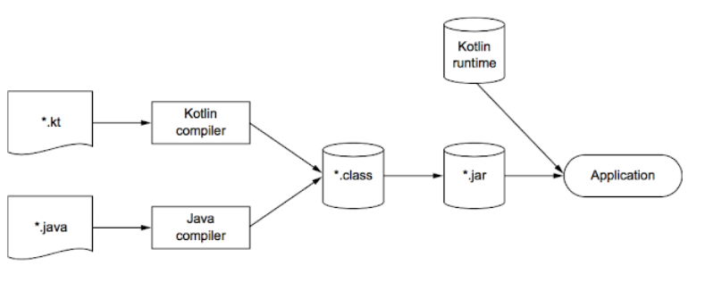
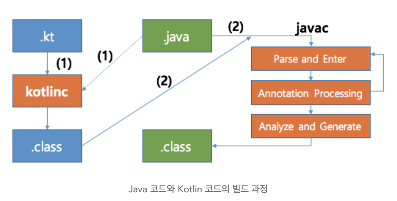

# 1회차


### 이번 회차에서 학습할 내용은?

- 코틀린 기본
- 변수, 상수, 연산자
- 조건문, 반복문
- 함수, 익명함수, 람다표현식, 클로저


### 간략한 코틀린의 역사

- 코틀린은 2010년에 jetbrains에서 개발을 시작하여 2016년 공식 release가 된 언어이다.
- 코틀린은 JVM, Android, JS, WASM(웹어셈블리)를 대상으로 하는 정적인 유형의 프로그래밍 언어이다.


### 코틀린을 쓰는 주요 장점은?

- 코틀린은 자바에 비해 대략적으로 코드 줄 수가 약 40% 감소하여 간결하다.
  - Collections.kt에 있는 다양한 메서드들이 코드를 매우 효율적으로 만든다.
- non-nullable을 지원을 통해, NullPointException 예방에 탁월합니다. (저는 이점이 너무 좋았습니다..)
- 스마트 캐스팅(자동 형변환), 고차함수, 확장함수등의 기능을 제공합니다. (특히 확장함수가 너무 좋았습니다..)


### 코틀린의 단점은?

- java에 비해 패키지 구조가 커진다.
- 그외는 모르겠습니다.. (단점이 뭐라고 생각하시는지 궁금해요.)


### 코틀린의 빌드 과정



1. .kt 파일을 코틀린 컴파일러가 .class파일로 생성
2. 각각의 패키징에 따라 실행 처리 진행
3. 어플리케이션 실행시 (런타임시) kotlin runtime 라이브러리에 의존하여 진행
   1. Kotlin runtime 라이브러리는 자바 + 코틀린만의 다양한 func를 제공




1. .kt 파일을 코틀린 컴파일러가 .class파일로 생성 (이때 참조된 java 코드가 묶여감)
2. Java 컴파일러가 .class파일을 생성하는데, 이 작업이 진행될 때 1번에서 만든 kotlin 기반의 .class가 추가되어짐


### 코틀린의 변수

- 코틀린에서는 val, var와 같은 키워드로 변수 선언을 시작한다.
  - `val name = "극락코딩"`
- 타입을 지정하지 않으면 컴파일러가 초기화 식을 분석해서 초기화 식의 타입을 변수 타입으로 지정
  - `val name: String = "극락코딩"`

- 코틀린에서는 `;`을 생략할 수 있다.
- 초기화식이 없다면, 변수의 타입을 꼭! 명시해야 한다.
  - `val name: String`
  - 변수에 어떤 값이 저장될지 컴파일러가 타입 추론을 할 수 없기 때문에..

- 코틀린의 불변객체와 가변객체
  - `val` 키워드를 쓰는 경우, 변경이 불가능한 참조
  - `var`키워드를 쓰는 경우, 변경이 가능한 참조


### 문자열 템플릿

자바에서 문자열을 치환하는 템플릿을 만들 때, 가독성이 떨어지거나 복잡해지는 경우가 다반사이다.

코틀린에서는 매우 쉽게 문자열 템플릿을 만들 수 있다.

```kotlin
val name = "극락코딩"
val message = "이름은 ${name}" // or val message = "이름은 $name"
```


개인적으로는 다음과 같은 형태로 문자열을 그대로 이용할 수 있는게 너무 편리했습니다.

```kotlin
val name = """
					kotlin 만만세!
										kotlin 만만세!
																				kotlin 만만세!
"""
```


### Const

컴파일 타임 상수를 지정할 때 사용한다.

컴파일이 진행되는 타임때 상수가 정의가 됨 -> 그렇기 때문에 원시적인 값만 가능!

```kotlin
const val name = "김동건"
```


### 코틀린의 연산자

코틀린의 연산자도 대부분의 자바 연산자와 마찬가지로 유사하게 혹은 같은 형식으로 사용되어진다.

그중에서 몇가지..다른 연산자 유형이 있다.


**비트 연산자**

```kotlin
val x = 0b1100
val y = 0b1010
val leftShifted = x shl 2 // 왼쪽으로 2비트 시프트
val rightShifted = x shr 1 // 오른쪽으로 1비트 시프트
val bitwiseAnd = x and y // 비트 AND 연산
val bitwiseOr = x or y // 비트 OR 연산
val bitwiseXor = x xor y // 비트 XOR 연산
val bitwiseNot = x.inv() // 비트 NOT 연산
```

비트연산의 경우, `shl, shr, and, or, xor, inv()` 등과 같이 특정 기호가 아닌 자연처럼 사용되어 진다.


**범위 연산자**

자바에서는 범위 연산자를 지원하지 않는다. 대부분 for문을 도는 형식을 사용한다.

그런데, kotlin에서는 범위 연산자를 지원한다.


```kotlin
val range = 1..10 // 1 <= range <= 10
val rangeByUntil = 1 until 10 // 1 <= rangeByUntil < 10

val isContained = 5 in range // 5가 범위 내에 있는지 확인 
```


**엘비스 연산자**

코틀린은 null을 허용하지 않는다. 대신 null인 객체에 대한 표기가 가능하다.

```kotlin
val name : String = "극락코딩" // null 불가
val name : String? = "극락코딩" // null 가능
```


엘비스 연산자는 Null이 아닌 경우 왼쪽 피연산자를 반환하며, null이면 오른쪽 피연산자를 반환한다.

```
val name : String? = "극락코딩" // null 가능
val nickname = name ?: "나락코딩"
```

null 관련 처리가 더욱 더 간단해진다.


### 코틀린의 조건문

- kotlin에서 if문은 statement가 아닌 expression이다. (자바에서는 Statement이다.)

```kotlin
val result = if(a > b) a else b
```


위와 다른 형식으로 조건문을 표현할 수 있다.

```kotlin
val result = a.takeIf { a > b} ?: b
val result = b.takeUnless { a > b } ?: a
```

kotlin library의 Standard.kt에서 다음의 func를 지원한다.

```kotlin
/**
 * Returns `this` value if it satisfies the given [predicate] or `null`, if it doesn't.
 *
 * For detailed usage information see the documentation for [scope functions](https://kotlinlang.org/docs/reference/scope-functions.html#takeif-and-takeunless).
 */
@kotlin.internal.InlineOnly
@SinceKotlin("1.1")
public inline fun <T> T.takeIf(predicate: (T) -> Boolean): T? {
    contract {
        callsInPlace(predicate, InvocationKind.EXACTLY_ONCE)
    }
    return if (predicate(this)) this else null
}

/**
 * Returns `this` value if it _does not_ satisfy the given [predicate] or `null`, if it does.
 *
 * For detailed usage information see the documentation for [scope functions](https://kotlinlang.org/docs/reference/scope-functions.html#takeif-and-takeunless).
 */
@kotlin.internal.InlineOnly
@SinceKotlin("1.1")
public inline fun <T> T.takeUnless(predicate: (T) -> Boolean): T? {
    contract {
        callsInPlace(predicate, InvocationKind.EXACTLY_ONCE)
    }
    return if (!predicate(this)) this else null
}
```


### 코틀린의 반복문

자바와 유사하게 반복문을 처리할 수 있고, 추가적인 func를 제공한다.

```kotlin
repeat((0..10).count()) { println("극락코딩 $it") }
```

repeat을 사용하게 되면, 기존의 for-each보다 간결하게 로직을 작성할 수 있다.

(대부분의 kotlin extension method 들이 functional하게 구성되어 있다.)


```kotlin
/**
 * Executes the given function [action] specified number of [times].
 *
 * A zero-based index of current iteration is passed as a parameter to [action].
 *
 * @sample samples.misc.ControlFlow.repeat
 */
@kotlin.internal.InlineOnly
public inline fun repeat(times: Int, action: (Int) -> Unit) {
    contract { callsInPlace(action) }

    for (index in 0 until times) {
        action(index)
    }
}
```


### 코틀린의 함수

기본적인 함수의 구조는 다음과 같다.

```kotlin
fun sum(a: Int, b: Int) : Int {
  	return a + b
}
```

자바와 다른 부분이 몇가지 있는데, 코틀린에서는 변수를 선언할 때 `name: type`  형태를 가진다.

추가적으로 특이한 점은 코틀린에서 함수는 중가로를 생략시킬 수 있다. (이것을 Single Expression Functions라고 부름 Sef)

```kotlin
fun sum(a: Int, b: Int) : Int = a + b
```


**확장함수(Extension Functions)** 

코틀린에는 다양한 함수 스타일을 지원하는데, 그중에 확장함수는 이미 만들어진 클래스에 새로운 함수를 추가하여 사용할 수 있도록 한다.

이미 만들어진 라이브러리에 대해 함수를 추가실킬 수 있는 기능이 매우 매력적..

```kotlin
fun String.name() : String = "이름은 $this"
```


**고차함수(Higher-Order Functions)**

매개변수로 함수를 받거나, 함수를 반환하는 함수를 고차함수라고 한다.

```kotlin
fun name(name: String, speak: (String) -> String): String {}
```

확실히 Kotlin이 Functional하게 코드를 작성하기 편리한 것 같다.


```kotlin
// docs example
fun <T, R> Collection<T>.fold(
    initial: R,
    combine: (acc: R, nextElement: T) -> R
): R {
    var accumulator: R = initial
    for (element: T in this) {
        accumulator = combine(accumulator, element)
    }
    return accumulator
}
```


**익명함수(Anonymous Functions)**

람다표현식에서 사용할 때 유용하며, 일반함수와 다른 점은 메서드의 네이밍이 없다.

```kotlin
// 익명함수
fun(x: Int, y: Int): Int = x + y

// example
ints.filter(fun(item) = item > 0)
```


### 코틀린의 람다 표현식


### 코틀린 클로저


### Reference

- [Kotlin Default](https://kotlinlang.org/docs/faq.html)
