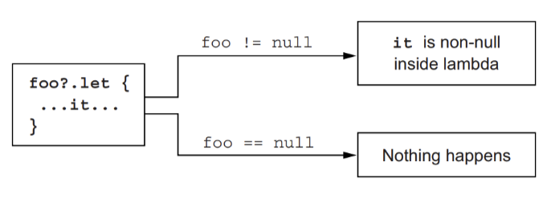
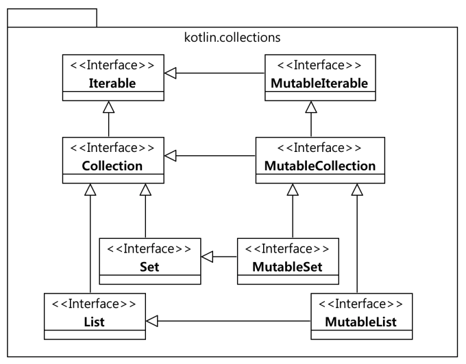

# 3회차

- 코틀린 기본
  - 예외처리
  - Type System (Null 처리)
  - 컬랙션, 배열
  


<br>

<br>


### 기본적인 try-catch

- java의 try-catch-finally를 kotlin에서도 그대로 사용 가능합니다.

```kotlin
fun tryCatch(message: String? = null) {
    try {
        message ?: throw RuntimeException()
    } catch (e: Exception) {
        println(e.message)
    } finally {
        println(message)
    }
}
```


<br>

<br>


### Kotlin에서 제공하는 runCatching

그런데, kotlin에서는 try-catch-finally보다는 runCatching을 사용하는 것을 권장합니다.

(try-catch-finally와 동일한 동작을 수행할 수 있고, 보다 복합적이고 편리한 기능들을 제공합니다. 더불어, 스타일도 달라요.)

```kotlin
fun runCatching(message: String? = null) {
    runCatching {
        message ?: throw RuntimeException()
    }.onFailure { e ->
        println(e.message)
    }.onSuccess { message ->
        println(message)
    }
}
```


- [RunCatching Kotlin Docs](https://kotlinlang.org/api/latest/jvm/stdlib/kotlin/run-catching.html)

- [Baeldung RunCatching vs Try-Catch-Finally](https://www.baeldung.com/kotlin/runcatching-vs-try-finally)


<br>

<br>


### Try-Catch-Finally vs runCatching

- Try-catch-finally는 언어 레벨에서 지원하는 기능입니다.
- 반면에, runCatching의 경우, kotlin core library에서 지원하는 function입니다.
  - org.jetbrains.kotlin:kotlin-reflect:kotlin (kotlin stdlib)
- 동작 방식의 차이
  - try-catch : 예외 발생시 즉시 처리
  - runCatching : 예외발생시, 예외 정보를 캡쳐하여 Result 객체를 반환하고, 이를 개발자가 핸들링 할 수 있는 function을 제공
    - 정말 다양한 메서드를 지원하고 있음


<br>

<br>


### RunCatching

코틀린 표준 라이브러리에서 제공하는 runCatching은 다음과 같습니다.

runCatching의 경우, 내부적으로 try-catch로 동작을 진행하며, Result라는 객체로 래핑을 진행합니다.

```kotlin
/**
 * Calls the specified function [block] and returns its encapsulated result if invocation was successful,
 * catching any [Throwable] exception that was thrown from the [block] function execution and encapsulating it as a failure.
 */
@InlineOnly
@SinceKotlin("1.3")
public inline fun <R> runCatching(block: () -> R): Result<R> {
    return try {
        Result.success(block())
    } catch (e: Throwable) {
        Result.failure(e)
    }
}

/**
 * Calls the specified function [block] with `this` value as its receiver and returns its encapsulated result if invocation was successful,
 * catching any [Throwable] exception that was thrown from the [block] function execution and encapsulating it as a failure.
 */
@InlineOnly
@SinceKotlin("1.3")
public inline fun <T, R> T.runCatching(block: T.() -> R): Result<R> {
    return try {
        Result.success(block())
    } catch (e: Throwable) {
        Result.failure(e)
    }
}
```


<br>


**public inline fun <R> runCatching(block: () -> R): Result<R>**

- 람다 함수 `block`를 받아서 실행하고, 그 결과를 `Result` 객체로 래핑하여 반환합니다. 
- 이 함수는 예외를 캐치하고 결과를 성공 또는 실패로 래핑합니다.


**public inline fun <T, R> T.runCatching(block: T.() -> R): Result<R>**

- 수신 객체(`this`로 참조)와 함께 람다 함수 `block`를 받아서 실행하고, 그 결과를 `Result` 객체로 래핑하여 반환합니다. 
- 이 함수는 예외를 캐치하고 결과를 성공 또는 실패로 래핑합니다.


<br>

<br>


### Result

- Result라는 개체는 value라는 파라미터를 갖고 있는데, 해당 값에는 기본적으로 Failure 클래스가 들어가게 됩니다.
  - value의 파라미터가 Any인 이유는 실패했을 때는 Failure 클래스가 들어가지만, 성공했을 때는 그외의 클래스가 들어갈 수 있기 때문입니다.
- 그리 주요 함수로는 isSuccess와 isFailurer가 있는데, 해당 함수들은 Failure 인스턴스를 비교하여 성공 및 실패 여부를 확인합니다.

```kotlin
/**
 * A discriminated union that encapsulates a successful outcome with a value of type [T]
 * or a failure with an arbitrary [Throwable] exception.
 */
@SinceKotlin("1.3")
@JvmInline
public value class Result<out T> @PublishedApi internal constructor(
    @PublishedApi
    internal val value: Any?
) : Serializable {
    // discovery

    /**
     * Returns `true` if this instance represents a successful outcome.
     * In this case [isFailure] returns `false`.
     */
    public val isSuccess: Boolean get() = value !is Failure

    /**
     * Returns `true` if this instance represents a failed outcome.
     * In this case [isSuccess] returns `false`.
     */
    public val isFailure: Boolean get() = value is Failure

    // value & exception retrieval

    /**
     * Returns the encapsulated value if this instance represents [success][Result.isSuccess] or `null`
     * if it is [failure][Result.isFailure].
     *
     * This function is a shorthand for `getOrElse { null }` (see [getOrElse]) or
     * `fold(onSuccess = { it }, onFailure = { null })` (see [fold]).
     */
    @InlineOnly
    public inline fun getOrNull(): T? =
        when {
            isFailure -> null
            else -> value as T
        }

    /**
     * Returns the encapsulated [Throwable] exception if this instance represents [failure][isFailure] or `null`
     * if it is [success][isSuccess].
     *
     * This function is a shorthand for `fold(onSuccess = { null }, onFailure = { it })` (see [fold]).
     */
    public fun exceptionOrNull(): Throwable? =
        when (value) {
            is Failure -> value.exception
            else -> null
        }

    /**
     * Returns a string `Success(v)` if this instance represents [success][Result.isSuccess]
     * where `v` is a string representation of the value or a string `Failure(x)` if
     * it is [failure][isFailure] where `x` is a string representation of the exception.
     */
    public override fun toString(): String =
        when (value) {
            is Failure -> value.toString() // "Failure($exception)"
            else -> "Success($value)"
        }

    // companion with constructors

    /**
     * Companion object for [Result] class that contains its constructor functions
     * [success] and [failure].
     */
    public companion object {
        /**
         * Returns an instance that encapsulates the given [value] as successful value.
         */
        @Suppress("INAPPLICABLE_JVM_NAME")
        @InlineOnly
        @JvmName("success")
        public inline fun <T> success(value: T): Result<T> =
            Result(value)

        /**
         * Returns an instance that encapsulates the given [Throwable] [exception] as failure.
         */
        @Suppress("INAPPLICABLE_JVM_NAME")
        @InlineOnly
        @JvmName("failure")
        public inline fun <T> failure(exception: Throwable): Result<T> =
            Result(createFailure(exception))
    }

    internal class Failure(
        @JvmField
        val exception: Throwable
    ) : Serializable {
        override fun equals(other: Any?): Boolean = other is Failure && exception == other.exception
        override fun hashCode(): Int = exception.hashCode()
        override fun toString(): String = "Failure($exception)"
    }
}
```


<br>

<br>


**public inline fun <T> Result<T>.getOrThrow(): T**

> `Result` 객체에 대한 확장 함수로 선언되어 있으며, 객체가 성공 상태인 경우 결과 값을 반환하고, 실패 상태인 경우 예외를 던집니다.

```kotlin
/**
 * Returns the encapsulated value if this instance represents [success][Result.isSuccess] or throws the encapsulated [Throwable] exception
 * if it is [failure][Result.isFailure].
 *
 * This function is a shorthand for `getOrElse { throw it }` (see [getOrElse]).
 */
@InlineOnly
@SinceKotlin("1.3")
public inline fun <T> Result<T>.getOrThrow(): T {
    throwOnFailure()
    return value as T
}

```

- `throwOnFailure`는 `Result` 객체의 내부 메서드로, 객체가 실패 상태인 경우 예외를 던지는 역할을 합니다.
- `InlineOnly`는 인라인 함수로 선언된 함수에 대한 어노테이션으로, 함수 호출을 인라인으로 처리하도록 컴파일러에 알려줍니다. 이렇게 하면 함수 호출의 오버헤드를 줄이고 최적화를 할 수 있습니다.


<br>


**public inline fun <R, T : R> Result<T>.getOrElse(onFailure: (exception: Throwable) -> R): R**

> `Result` 객체에 대한 확장 함수로 선언되어 있으며, 객체가 성공 상태인 경우 결과 값을 반환하고, 객체가 실패 상태인 경우 `onFailure` 함수를 호출하여 예외 처리를 수행합니다.

```kotlin
/**
 * Returns the encapsulated value if this instance represents [success][Result.isSuccess] or the
 * result of [onFailure] function for the encapsulated [Throwable] exception if it is [failure][Result.isFailure].
 *
 * Note, that this function rethrows any [Throwable] exception thrown by [onFailure] function.
 *
 * This function is a shorthand for `fold(onSuccess = { it }, onFailure = onFailure)` (see [fold]).
 */
@InlineOnly
@SinceKotlin("1.3")
public inline fun <R, T : R> Result<T>.getOrElse(onFailure: (exception: Throwable) -> R): R {
    contract {
        callsInPlace(onFailure, InvocationKind.AT_MOST_ONCE)
    }
    return when (val exception = exceptionOrNull()) {
        null -> value as T
        else -> onFailure(exception)
    }
}
```

-  `onFailure` 함수는 실패 상태의 `Result` 객체에 대한 예외 처리 로직을 정의하는 함수입니다.
  -  `onFailure` 함수는 `Throwable` 예외 객체를 인자로 받아서 호출되며, 그 결과값이 `getOrElse` 함수의 반환값이 됩니다.


<br>

<br>


**public inline fun <R, T : R> Result<T>.getOrDefault(defaultValue: R): R**

> `Result` 객체에 대한 확장 함수로 선언되어 있으며, 객체가 성공 상태인 경우 결과 값을 반환하고, 객체가 실패 상태인 경우 `defaultValue`를 반환합니다.

```kotlin
/**
 * Returns the encapsulated value if this instance represents [success][Result.isSuccess] or the
 * [defaultValue] if it is [failure][Result.isFailure].
 *
 * This function is a shorthand for `getOrElse { defaultValue }` (see [getOrElse]).
 */
@InlineOnly
@SinceKotlin("1.3")
public inline fun <R, T : R> Result<T>.getOrDefault(defaultValue: R): R {
    if (isFailure) return defaultValue
    return value as T
}
```

- `defaultValue`는 `getOrDefault` 함수의 매개변수로, 객체가 실패 상태일 때 반환할 기본값을 나타냅니다.


<br>

<br>


**public inline fun <R, T> Result<T>.fold(onSuccess: (value: T) -> R,onFailure: (exception: Throwable) -> R): R**

> `Result` 객체를 검사하고, 객체가 성공(`success`) 상태인 경우 `onSuccess` 함수를 호출하여 결과를 반환하며, 객체가 실패(`failure`) 상태인 경우 `onFailure` 함수를 호출하여 예외 처리를 수행합니다.

````kotlin
/**
 * Returns the result of [onSuccess] for the encapsulated value if this instance represents [success][Result.isSuccess]
 * or the result of [onFailure] function for the encapsulated [Throwable] exception if it is [failure][Result.isFailure].
 *
 * Note, that this function rethrows any [Throwable] exception thrown by [onSuccess] or by [onFailure] function.
 */
@InlineOnly
@SinceKotlin("1.3")
public inline fun <R, T> Result<T>.fold(
    onSuccess: (value: T) -> R,
    onFailure: (exception: Throwable) -> R
): R {
    contract {
        callsInPlace(onSuccess, InvocationKind.AT_MOST_ONCE)
        callsInPlace(onFailure, InvocationKind.AT_MOST_ONCE)
    }
    return when (val exception = exceptionOrNull()) {
        null -> onSuccess(value as T)
        else -> onFailure(exception)
    }
}
````

- `onSuccess` 함수는 성공 상태의 `Result` 객체에 대한 처리 로직을 정의하는 함수입니다. `onSuccess` 함수는 `T` 타입의 결과값을 인자로 받아서 호출되며, 그 결과값이 `fold` 함수의 반환값이 됩니다.
-  `onFailure` 함수는 실패 상태의 `Result` 객체에 대한 예외 처리 로직을 정의하는 함수입니다. `onFailure` 함수는 `Throwable` 예외 객체를 인자로 받아서 호출되며, 그 결과값이 `fold` 함수의 반환값이 됩니다.


<br>

<br>


**public inline fun <R, T> Result<T>.map(transform: (value: T) -> R): Result<R>**

>  `Result` 객체에 대한 확장 함수로 선언되어 있으며, 객체의 상태에 따라 `transform` 함수를 적용하고 결과를 반환합니다.

```kotlin
/**
 * Returns the encapsulated result of the given [transform] function applied to the encapsulated value
 * if this instance represents [success][Result.isSuccess] or the
 * original encapsulated [Throwable] exception if it is [failure][Result.isFailure].
 *
 * Note, that this function rethrows any [Throwable] exception thrown by [transform] function.
 * See [mapCatching] for an alternative that encapsulates exceptions.
 */
@InlineOnly
@SinceKotlin("1.3")
public inline fun <R, T> Result<T>.map(transform: (value: T) -> R): Result<R> {
    contract {
        callsInPlace(transform, InvocationKind.AT_MOST_ONCE)
    }
    return when {
        isSuccess -> Result.success(transform(value as T))
        else -> Result(value)
    }
}
```

-  `transform` 함수는 성공 상태의 `Result` 객체에 대한 변환 로직을 정의하는 함수입니다.
  -  `transform` 함수는 `T` 타입의 결과값을 인자로 받아서 호출되며, 그 결과값이 `map` 함수의 반환값인 `Result<R>`의 성공 상태로 래핑됩니다.


<br>

<br>


**public inline fun <R, T> Result<T>.mapCatching(transform: (value: T) -> R): Result<R>**

> `Result` 객체를 검사하고, 객체가 성공(`success`) 상태인 경우 `transform` 함수를 적용하여 변환된 결과를 반환하며, 객체가 실패(`failure`) 상태인 경우 원래의 `Throwable` 예외를 포함하여 반환

```kotlin
/**
 * Returns the encapsulated result of the given [transform] function applied to the encapsulated value
 * if this instance represents [success][Result.isSuccess] or the
 * original encapsulated [Throwable] exception if it is [failure][Result.isFailure].
 *
 * This function catches any [Throwable] exception thrown by [transform] function and encapsulates it as a failure.
 * See [map] for an alternative that rethrows exceptions from `transform` function.
 */
@InlineOnly
@SinceKotlin("1.3")
public inline fun <R, T> Result<T>.mapCatching(transform: (value: T) -> R): Result<R> {
    return when {
        isSuccess -> runCatching { transform(value as T) }
        else -> Result(value)
    }
}
```

- `mapCatching` 함수는 `transform` 함수에서 발생한 예외를 잡아내어 실패 상태의 `Result`로 래핑합니다.
-  `transform` 함수는 성공 상태의 `Result` 객체에 대한 변환 로직을 정의하는 함수입니다.
  -  `transform` 함수는 `T` 타입의 결과값을 인자로 받아서 호출되며, 그 결과값이 `mapCatching` 함수에서 실패 상태의 `Result`로 래핑됩니다.
-  `runCatching` 함수는 예외를 캡처하고 실패한 경우 `Result` 객체를 생성하는 함수입니다. 
  - 이 함수는 예외를 던지지 않고 예외를 포함한 `Result` 객체를 반환합니다.


<br>

<br>


**public inline fun <R, T : R> Result<T>.recover(transform: (exception: Throwable) -> R): Result<R>**

> `Result` 객체를 검사하고, 객체가 실패(`failure`) 상태인 경우 `transform` 함수를 적용하여 `Throwable` 예외를 변환한 결과를 반환하며, 객체가 성공(`success`) 상태인 경우 원래의 결과값을 반환합니다.

```kotlin
/**
 * Returns the encapsulated result of the given [transform] function applied to the encapsulated [Throwable] exception
 * if this instance represents [failure][Result.isFailure] or the
 * original encapsulated value if it is [success][Result.isSuccess].
 *
 * Note, that this function rethrows any [Throwable] exception thrown by [transform] function.
 * See [recoverCatching] for an alternative that encapsulates exceptions.
 */
@InlineOnly
@SinceKotlin("1.3")
public inline fun <R, T : R> Result<T>.recover(transform: (exception: Throwable) -> R): Result<R> {
    contract {
        callsInPlace(transform, InvocationKind.AT_MOST_ONCE)
    }
    return when (val exception = exceptionOrNull()) {
        null -> this
        else -> Result.success(transform(exception))
    }
}
```

-  `Result` 객체에 대한 확장 함수로 선언되어 있으며, 객체의 상태에 따라 `transform` 함수를 적용하고 결과를 반환합니다. `recover` 함수는 실패 상태의 `Result` 객체에 대한 예외 처리 로직을 정의하는 함수입니다. `transform` 함수는 `Throwable` 예외 객체를 인자로 받아서 호출되며, 그 결과값이 `Result<R>`의 성공 상태로 래핑됩니다.
- `transform` 함수는 실패 상태의 `Result` 객체에 대한 변환 로직을 정의하는 함수입니다. `transform` 함수는 `Throwable` 예외 객체를 인자로 받아서 호출되며, 그 결과값이 `Result<R>`의 성공 상태로 래핑됩니다.


<br>

<br>


**public inline fun <R, T : R> Result<T>.recoverCatching(transform: (exception: Throwable) -> R): Result<R>**

> `Result` 객체를 검사하고, 객체가 실패(`failure`) 상태인 경우 `transform` 함수를 적용하여 `Throwable` 예외를 변환한 결과를 반환하며, 객체가 성공(`success`) 상태인 경우 원래의 결과값을 반환합니다.

```kotlin
/**
 * Returns the encapsulated result of the given [transform] function applied to the encapsulated [Throwable] exception
 * if this instance represents [failure][Result.isFailure] or the
 * original encapsulated value if it is [success][Result.isSuccess].
 *
 * This function catches any [Throwable] exception thrown by [transform] function and encapsulates it as a failure.
 * See [recover] for an alternative that rethrows exceptions.
 */
@InlineOnly
@SinceKotlin("1.3")
public inline fun <R, T : R> Result<T>.recoverCatching(transform: (exception: Throwable) -> R): Result<R> {
    return when (val exception = exceptionOrNull()) {
        null -> this
        else -> runCatching { transform(exception) }
    }
}
```

-  이 함수는 `Result` 객체에 대한 확장 함수로 선언되어 있으며, 객체의 상태에 따라 `transform` 함수를 적용하고 결과를 반환합니다. `recoverCatching` 함수는 실패 상태의 `Result` 객체에 대한 예외 처리 로직을 정의하는 함수입니다. `transform` 함수는 `Throwable` 예외 객체를 인자로 받아서 호출되며, 그 결과값이 `Result<R>`의 성공 상태로 래핑됩니다.
-  `transform` 함수는 실패 상태의 `Result` 객체에 대한 변환 로직을 정의하는 함수입니다. `transform` 함수는 `Throwable` 예외 객체를 인자로 받아서 호출되며, 그 결과값이 `Result<R>`의 성공 상태로 래핑됩니다.
-  `runCatching` 함수는 예외를 캡처하고 실패한 경우 `Result` 객체를 생성하는 함수입니다. 이 함수는 예외를 던지지 않고 예외를 포함한 `Result` 객체를 반환합니다.


**public inline fun <T> Result<T>.onFailure(action: (exception: Throwable) -> Unit): Result<T>**

> `Result` 객체를 검사하고, 객체가 실패(`failure`) 상태인 경우 `action` 함수를 적용하여 `Throwable` 예외를 처리합니다. 
>
> 그리고 원래의 `Result` 객체를 변경하지 않고 반환합니다.

```kotlin
/**
 * Performs the given [action] on the encapsulated [Throwable] exception if this instance represents [failure][Result.isFailure].
 * Returns the original `Result` unchanged.
 */
@InlineOnly
@SinceKotlin("1.3")
public inline fun <T> Result<T>.onFailure(action: (exception: Throwable) -> Unit): Result<T> {
    contract {
        callsInPlace(action, InvocationKind.AT_MOST_ONCE)
    }
    exceptionOrNull()?.let { action(it) }
    return this
}
```

- 이 함수는 `Result` 객체에 대한 확장 함수로 선언되어 있으며, 객체의 상태에 따라 `action` 함수를 적용하여 실패 상태의 `Result` 객체에 대한 예외 처리 로직을 정의합니다. `action` 함수는 `Throwable` 예외 객체를 인자로 받아서 호출되며, 예외 처리 작업을 수행합니다.
-  `action` 함수는 실패 상태의 `Result` 객체에 대한 예외 처리 로직을 정의하는 함수입니다. `action` 함수는 `Throwable` 예외 객체를 인자로 받아서 호출되며, 예외 처리 작업을 수행합니다.


<br>

<br>


**public inline fun <T> Result<T>.onSuccess(action: (value: T) -> Unit): Result<T>**

> `Result` 객체를 검사하고, 객체가 성공(`success`) 상태인 경우 `action` 함수를 적용하여 성공 상태의 `Result` 객체에 대한 작업을 수행합니다. 
>
> 그리고 원래의 `Result` 객체를 변경하지 않고 반환합니다.

```kotlin
/**
 * Performs the given [action] on the encapsulated value if this instance represents [success][Result.isSuccess].
 * Returns the original `Result` unchanged.
 */
@InlineOnly
@SinceKotlin("1.3")
public inline fun <T> Result<T>.onSuccess(action: (value: T) -> Unit): Result<T> {
    contract {
        callsInPlace(action, InvocationKind.AT_MOST_ONCE)
    }
    if (isSuccess) action(value as T)
    return this
}
```

- 이 함수는 `Result` 객체에 대한 확장 함수로 선언되어 있으며, 객체의 상태에 따라 `action` 함수를 적용하고 성공 상태의 `Result` 객체에 대한 작업을 정의합니다. `action` 함수는 `T` 타입의 결과값을 인자로 받아서 호출되며, 성공 상태에서만 호출됩니다.
- `action` 함수는 성공 상태의 `Result` 객체에 대한 작업 로직을 정의하는 함수입니다. `action` 함수는 `T` 타입의 결과값을 인자로 받아서 호출되며, 성공 상태에서만 호출됩니다.


<br>

<br>


---


### 코클린 타입 시스템

- 널 가능성
- 코틀린의 원시 타입
- 컬렉션과 배열


<br><br>


**[NullPointerException](https://docs.oracle.com/javase%2F7%2Fdocs%2Fapi%2F%2F/java/lang/NullPointerException.html)**

- 수많은 기간동안 개발자들을 괴롭혀온 버그입니다.

- NullPointerException은 다음과 같은 상황에서 자주 발생합니다.

  - ull 객체의 인스턴스 메서드를 호출하는 경우.
  - null 객체의 필드를 접근하거나 수정하는 경우.
  - null의 길이를 배열처럼 다루는 경우.
  - null을 배열처럼 다루어 슬롯에 접근하거나 수정하는 경우.
  - null을 Throwable 값으로 던지려고 하는 경우.

- Java Docs를 보면, 아래의 문구를 확인할 수 있습니다. 그만큼 위험하다는 것을 반증하고 있습니다.

  - ```
    NullPointerException 객체가 가상 머신(Virtual Machine)에서 생성될 수 있다는 것이며, 때로는 예외의 suppression이 비활성화되어 있거나 스택 추적 정보가 쓰기 불가능한 상태로 생성될 수 있다는 것입니다. 따라서 NullPointerException을 처리할 때 주의가 필요하며, 개발자는 null 값을 올바르게 처리하고 해당 예외를 방지하기 위해 노력해야 합니다.
    ```

- 코틀린을 비롯한 최신 언어들은 Null을 컴파일 시점에 확인할 수 있게 제공합니다.


<br><br>


**널 가능성 : null이 될 수 있는 타입**

- 코틀린은 널이 될 수 있는 타입과 널이 될 수 없는 타입을 명시적으로 지원합니다.
  - null과 관련된 문제를 가능한 실행 시점에서 컴파일 시점으로 옮김


<br><br>


**null이 될 수 있는 타입**

- 타입 이름 뒤에 물음표를 붙여 null이 될 수 있는 타입임을 나타낼 수 있습니다.
- 프로퍼티나 변수에 null 가능 타입 지정 가능합니다.


<br>

<br>


**Class에서 null이 될 수 있는 파라미터**

```kotlin
data Goofy(
		val name: String?
)
```

function에서 Null이 될 수 있는 파라미터

```kotlin
fun get(): String? {

}
```


<br><br>


**null이 될 수 없는 타입**

다음과 같이 ?이 없는 경우에는 null을 허용하지 않습니다.

```kotlin
data Goofy(
		val name: String
)
```


<br><br>


**null 가능 타입을 위한 연산자 ?.**

null이 될 수 있는 값에 대해 안전하게 해당 데이터를 관리하고 로직을 처리할 수 있게 하기 위해 코틀린에서는 `?.`연산자를 지원합니다.

- 호출하는 값이 null이 아니라면 일반 메서드 호출처럼 작동합니다.
- 호출하려는 값이 null이면 호출을 무시하고 null이 결과 값으로 반환됩니다.

```kotlin
fun length(name: String?): Int? {
	return name?.length
}
```


<br>

<br>


**엘비스 연산자 ?:**

- 좌항 값이 널이 아니면 좌항 값을 결과로 하고, 좌항 값이 널이면 우항 값을 결과로 제공하는 연산자입니다.

```kotlin
fun length(name: String?): Int {
	return name?.length ?: 0
}
```


<br>

<br>


**안전한 캐스트 as?**

지정한 타입으로 캐스트하는데, 대상 타입으로 변환할 수 없으면 null을 리턴합니다.

```kotlin
fun equals(o: Any?): Boolean {
	// val other: Person? = o as? Person
	val other: Person = o as? Person ?: return false
	return ...
}
```

파라미터가 적절한 타입을 가지고 있는지 확인하고, 캐스팅하고, 적절하지 않을 경우 false를 돌려보낼 수 있다.

이를 통해서 자바에서 자주 발생했던 ClassCastException을 방지할 수 있습니다.


<br>

<br>


**널 아님 단언: !!**

어떤 값이든 널이 될 수 없는 타입으로 바꿈. 값 null이면 NPE 발생합니다.

```kotlin
fun ignoreNulls(s: String?) {
	val notNull: String = s!! // s가 null이면 Kotlin NPE 발생
	...
}
```

해당 연산자를 사용할 때는 주의 해야합니다. 무분별하게 !!을 사용하면, 에러 발생시 추척에 어려움이 있습니다.

```
name.goofy!!.nickname!!
```


<br>

<br>


**let**

- 자신의 수신 객체를 인자로 전달받은 람다에게 넘깁니다.
- 널 가능 타입을 널이 될 수 없는 타입은 인자로 받는 함수에 전달할 때 유용합니다.

```kotlin
fun sendEmail(email: String) { ... }

// let의 수신 객체 v는 not null
val email: String? = ...

email?.let { v: String ‐> sendEmail(v) }
// email?.let { sendEmail(it) }
// if (email != null) sendEmail(email)

// let의 수신 객체 v는 nullable
email.let { v: String? ‐> println("이메일 $v") }
```




?.let을 통해, 해당 데이터가 null이 아닐 때에 대한 처리 로직 구현을 간단하게 진행할 수 있습니다.


<br>

<br>


**lateinit 프로퍼티**

널이 될 수 없는 프로퍼티를 생성 시점이 아닌 나중에 초기화할 수 있게 합니다.

- 프로퍼티는 var이어야 합니다. (lazy니까!)
  - lateinit 프로퍼티를 초기화 전에 접근하면 익셉션 발생합니다.
    - ex) “lateinit property myService has not been initialized”


```kotlin
class MyTest {
		private lateinit var myService: MyService = null

		@Before fun setUp() {
			myService = MyService()
		}
}
```


<br>

<br>


**널 가능 타입의 확장**

널 가능 타입에 확장을 정의하면 널이 될 수 있는 값에 대해 그 확장 함수를 호출할 수 있습니다.

- 확장 함수 안에서 this의 null 여부 검사하므로, 안전한 호출이 필요 없습니다.

```kotlin
fun CharSequence?.isNullOrBlank(): Boolean { ... }

val str: String? = ...
str.isNullOrBlank() // 안전안 호출(?.)을 하지 않아도 됨
```


**제네릭 타입 파라미터의 널 가능성**

- 모든 타입 파라미터는 기본적으로 널이 가능합니다.
- 널 가능 타입과 널 불가 타입 모두 타입 파라미터 인자로 사용 가능합니다.

```kotlin
fun <T> printHashCode(t: T) { // t는 Any?로 추론
		println(t?.hashCode()) // t.hashCode()는 컴파일 에러.
}

// 타입 파라미터의 상한 지정
fun <T: Any> printHashCode(t: T) { // t는 Any 타입으로 추론
		println(t.hashCode())
}
```


**example code**

```kotlin
// 타입 파라미터는 유일하게 Any?로 추론되므로 nullable하다.
fun <T> some1(): T = TODO()

// 상한을 두어 null이 불가능하게 할 수도 있다.
fun <T : Any> some2(): T = TODO()
```


<br>

<br>


**자바의 널 가능성 애노테이션**

자바 코드에 널 가능성 애노테이션을 사용하면, 코틀린은 그 정보를 활용하여 사용합니다.

**(JSR‐305 표준, 안드로이드, 젯브레인 애노테이션 등의 널 가능성 애노테이션 지원)**

- @Nullable String ‐> String? 
- @NotNull String ‐> String 


그런데, 어차피 코틀린은 null처리에 대한 다양한 방식을 제공하기 때문에, 굳이 어노테이션을 사용해야 될 까 고민이 되기도 합니다.


**플랫폼 타입**

- 널 관련 정보를 알 수 없는 자바 타입 
  - 널 가능 타입으로 처리해도 되고 널 불가 타입으로 처리해도 됨 
  - 널 가능성을 코틀린 코드에서 알맞게 처리해야 함


**코틀린이 null에 대한 정보를 알수 없는 타입일 경우, 처리를 개발자에게 전적으로 맡기게 된다.**

```kotlin
/* Java */
public class Person {
	private final String name;
	public Person(String name) {
		this.name = name;
	}
	public String getName() {
		return name;
	}
}

```


```kotlin
fun yellAt(p: Person) {
		// name의 플랫폼 타입을 널 불가 타입처럼 처리한 예
		// person.name 사용 전에 코틀린 컴파일러가 null 검사 코드 추가
		println(person.name.toUpperCase() + "!!!")
}

// person.name이 null일 때 익셉션 발생
Exception in thread "main" java.lang.IllegalStateException:
person.name must not be null
```


```kotlin
fun yellAtSafe(p: Person) {
		// name의 플랫폼 타입을 널 가능 타입처럼 처리한 예
		println( (person.name ?: "Anyone").toUpperCase() + "!!!")
}
```


<br>

<br>


**자바 클래스를 코틀린에서 상속**

메서드 파라미터와 리턴 타입을 널 가능 타입이나 널 불가 타입으로 선언할지 결정합니다.


```kotlin
interface StringProcessor {
		void process(String value);
}

class StringPrinter : StringProcessor {
		override fun process(value: String) { // 널 불가로 선언
		// 컴파일러가 널이 아님을 검사하는 단언 추가
		println(value)
		}
}

class NullableStringPrinter : StringProcessor {
		override fun process(value: String?) { // 널 가능으로 선언
		value.?let { println(it) }
		}
}

val sp: StringProcessor = StringPrinter()

// sp.process ‐> process(value: String!)
sp.process(null)

// Exception in thread "main" java.lang.IllegalArgumentException:
// Parameter specified as non‐null is null:
// method chap06.StringPrinter.process, parameter value
```

이때 자바 메소드를 오버라이드하고, 메소드 변수가 null 불가능한 타입으로 선언되었을 경우 컴파일러는 null 아님을 단언하는 확인을 자동으로 추가해줍니다.


<br>

<br>


**원시타입**

일단, 자바는 원시 타입과 레퍼런스 타입의 명확한 구분을 가집니다. 반면에, 코틀린은 원시 타입과 래퍼 타입의 구분이 없습니다.

내부적으로 런타임에 가장 효율적인 방식으로 타입 처리를 진행합니다.

- 실행 시점에 숫자 타입은 가능한 한 효율적인 방식으로 표현합니다.
  - 대부분의 경우 코틀린 숫자 타입은 자바 원시 타입으로 컴파일 
- 널 가능 원시 타입은 랲퍼 타입으로 컴파일합니다.
  - 코틀린 Int? ‐> 자바 Integer
- 제네릭 클래스의 경우 래퍼 타입 사용합니다.


**자바의 원시타입 - 코틀린 타입**

- **Integer types—Byte, Short, Int, Long**
- **Floating-point number types—Float, Double**
- **Character type—Char**
- **Boolean type—Boolean**


<br>

<br>


**숫자 변환**

- 숫자 타입을 다른 타입 숫자로 자동 변화하지 않습니다.
  - 명시적으로 진행해야 합니다.

```kotlin
val i = 1
val l: Long = i
```

(다음과 같은 작업을 진행하면, type mismatch가 발생할 수 있습니다.)


- 숫자 리터럴은 컴파일러가 필요한 변환을 자동으로 처리합니다.
- 연산자를 각 타입에 대해 오버로딩하고 있습니다.


이런 부분에 대해 개발자가 더 확실히 처리해야 하긴 합니다.

```kotlin
val b: Byte = 1
val l = b + 1L

// Int 타입 리터럴을 Long으로 컴파일러가 변환
val l1: Long = 42 
val i1: Int = 42

// val l2: Long = i1 // 컴파일 에러
val l2: Long = i1.toLong()
```


<br>

<br>


**Any와 Any? : 최상위 타입**

자바에서는 Object가 모든 클래스의 루트이다. 반면에 코틀린에서 타입의 최상위는 Any이다.

- Any: Int 등 원시 타입을 포함한 모든 널 불가 타입의 조상 타입
- 내부에서 Any는 Object에 대응 
  - 코틀린에서 Any를 사용하면 자바 바이트코드의 Object로 컴파일
- Any: toString, equals, hashCode 세 개의 메서드 제공 
  - wait, notify 등은 제공하지 않음


```kotlin
/**
 * The root of the Kotlin class hierarchy. Every Kotlin class has [Any] as a superclass.
 */
public open class Any {
    /**
     * Indicates whether some other object is "equal to" this one. Implementations must fulfil the following
     * requirements:
     *
     * * Reflexive: for any non-null value `x`, `x.equals(x)` should return true.
     * * Symmetric: for any non-null values `x` and `y`, `x.equals(y)` should return true if and only if `y.equals(x)` returns true.
     * * Transitive:  for any non-null values `x`, `y`, and `z`, if `x.equals(y)` returns true and `y.equals(z)` returns true, then `x.equals(z)` should return true.
     * * Consistent:  for any non-null values `x` and `y`, multiple invocations of `x.equals(y)` consistently return true or consistently return false, provided no information used in `equals` comparisons on the objects is modified.
     * * Never equal to null: for any non-null value `x`, `x.equals(null)` should return false.
     *
     * Read more about [equality](https://kotlinlang.org/docs/reference/equality.html) in Kotlin.
     */
    public open operator fun equals(other: Any?): Boolean

    /**
     * Returns a hash code value for the object.  The general contract of `hashCode` is:
     *
     * * Whenever it is invoked on the same object more than once, the `hashCode` method must consistently return the same integer, provided no information used in `equals` comparisons on the object is modified.
     * * If two objects are equal according to the `equals()` method, then calling the `hashCode` method on each of the two objects must produce the same integer result.
     */
    public open fun hashCode(): Int

    /**
     * Returns a string representation of the object.
     */
    public open fun toString(): String
}

```


<br>

<br>


**Unit 타입**

- Unit 타입은 자바의 void와 유사 
  - 관심을 가질 만한 내용을 리턴하지 않는 함수의 리턴 타입으로 Unit 사용 
  - 리턴 타입 선언 없이 정의한 블록 몸체를 가진 함수는 Unit이 리턴 타입 
- 함수 반환 타입이 Unit이고, 지네릭 함수를 재정의한 것이 아니면, 내부적으로 자바 void 함수로 컴파일 
- Unit은 void와 달리 타입, Unit이라는 단일 값을 가짐 
  - 리턴 타입이 Unit인 함수는 묵시적으로 Unit을 리턴
- Unit은 생략할 수 있습니다!


```kotlin
interface Processor<T> {
		fun process(): T

}

class NoResultProcessor: Processor<Unit> {
		override fun process() {
			// 컴파일러가 return Unit을 넣음
		}
}
```


**Unit.kt**

```kotlin
package kotlin

/**
 * The type with only one value: the `Unit` object. This type corresponds to the `void` type in Java.
 */
public object Unit {
    override fun toString() = "kotlin.Unit"
}

```


<br>

<br>


**Nothing 타입**

- 함수가 정상적으로 끝나지 않는다는 사실을 표현

```kotlin
fun fail(message: String): Nothing {
		throw IllegalStateException(message)
}
```

- Nothing 타입은 아무 값도 포함하지 않음 
- 함수의 리턴 타입이나 리턴 타입으로 쓰일 타입 파라미터로만 사용 가능

- Nothing도 생략 가능하다!!


<br>

<br>


### **Kotlin Collection**

- [Collections And Arrays by Kotlin Docs](https://kotlinlang.org/docs/whatsnew14.html#new-functions-for-arrays-and-collections)


**인터페이스 분리** 

- kotlin.collections.Collection : 조회 기능만 제공 
  - 인터페이스만 읽기 전용이고, 실제 구현체는 수정 가능할 수 있다.
- kotlin.collections.MutableCollection : 수정 기능도 제공


**java collection and kotlin collection**

- 코틀린의 모든 컬렉션은 자바 컬렉션 인터페이스의 구현체이므로 언제든지 서로 오갈 수 있다.
- 코틀린은 자바 컬렉션을 구현했지만 읽기 전용 클래스와 변경 가능 컬렉션(MutableCollection)을 분리했다.




**Collection 생성 함수**

- List
  - listOf
    - metableListOf, arrayListOf
- Set
  - setOf 
    - mutableSetOf, hashSetOf, linkedSetOf, sortedSetOf
- Map
  - mapOf
    - mutableMapOf, hashMapOf, linkedMapOf, sortedMapOf


**코틀린 콜렉션을 자바 메서드에 전달**

> 코틀린 읽기 전용 콜렉션을 자바 메서드에 전달해도 자바에서는 수정 가능함에 주의해야 한다.
>
> 코틀린은 읽기전용 컬렉션이 존재하지만, 자바는 없다. 그렇기에 자바에서 해당 값에 대한 수정 작업 처리를 진행하는 에러가 발생할 수 있다.

- 코틀린과 자바 컬렉션은 서로 상호작용하는 인터페이스가 존재한다. 
  - 이 사이에는 변환이 필요 없으며, 데이터를 복사하거나 wrapper를 생성할 필요가 없다. 
  - 그런데 모든 자바 컬렉션에는 2개의 코틀린 컬렉션, 즉 읽기 전용과 변경 가능한 컬렉션이 존재한다.

- 자바는 읽기 전용과 변경 가능을 구분하지 않기 때문에 읽기 전용 컬렉션을 변경하게 될 수도 있다. 
  - 이때 코틀린은 읽기 전용 컬렉션을 자바가 변경하려는 경우 그 호출을 거절한다.


```kotlin
/* Java */
// CollectionUtils.java
public class CollectionUtils {
	public static List<String> uppercaseAll(List<String> items) {
		for (int i = 0; i < items.size(); i++) {
			items.set(i, items.get(i).toUpperCase()); //변경 시도
		}
		return items;
	}
}
// Kotlin
// collections.kt
fun printInUppercase(list: List<String>) {
	println(CollectionUtils.uppercaseAll(list))
	println(list.first())
}
>>> val list = listOf("a", "b", "c")
>>> printInUppercase(list)
[A, B, C]
A
```

따라서 코틀린 컬렉션을 자바에게 넘겨줄 때는 정확한 파라미터 타입을 개발자가 작성해야 한다.!!


<br>

<br>


**kotlin Collection과 java Collection 차이**

1. **Null Safety (Null 안정성):**
   - Kotlin은 기본적으로 null 안정성을 제공합니다. Kotlin 컬렉션은 null 값을 포함할 수 있는 컬렉션과 null을 허용하지 않는 컬렉션으로 나뉩니다. 이것은 NullPointerExceptions를 방지하는 데 도움이 됩니다. 반면 Java 컬렉션은 모든 객체가 null일 수 있으므로 주의가 필요합니다.
2. **Immutable by Default (기본으로 불변):**
   - Kotlin의 컬렉션은 기본적으로 불변(immutable)이며, 수정할 수 없는 컬렉션을 사용하려면 별도의 함수를 호출해야 합니다. Java 컬렉션은 가변(mutable)하며, 수정 가능한 컬렉션을 사용하려면 Collections 클래스의 `unmodifiableXXX` 메서드를 사용해야 합니다.
3. **Extension Functions (확장 함수):**
   - Kotlin은 확장 함수를 사용하여 컬렉션에 새로운 메서드를 추가하고 변환할 수 있습니다. 이로써 Kotlin 컬렉션을 보다 풍부하게 다룰 수 있습니다. Java에서는 이러한 기능을 사용할 수 없습니다.
4. **Type Inference (타입 추론):**
   - Kotlin은 타입 추론을 통해 보다 간결한 코드 작성을 지원합니다. Java에서는 타입 지정이 더 복잡할 수 있습니다.
5. **Range and Progression:**
   - Kotlin은 Range와 Progression 개념을 도입하여 숫자나 문자열 범위를 더 쉽게 다룰 수 있게 했습니다. Java에서는 이러한 기능이 기본적으로 제공되지 않습니다.
6. **DSL (Domain-Specific Language) 지원:**
   - Kotlin은 DSL을 구축하고 사용하는 데 용이한 언어 특성을 가지고 있어, 컬렉션을 다루는 DSL을 쉽게 구현할 수 있습니다. 이는 Kotlin을 통해 표현력 있는 DSL을 작성하는 데 도움이 됩니다.
7. **Collection Factory Functions:**
   - Kotlin은 불변 컬렉션을 생성하는 데 사용할 수 있는 factory 함수를 제공합니다. Java에서는 컬렉션을 생성하려면 별도의 초기화 코드가 필요합니다.
8. **Default Arguments:**
   - Kotlin은 함수에 기본 인수 값을 제공할 수 있으므로 컬렉션 생성 또는 조작과 관련된 함수를 더 유연하게 사용할 수 있습니다.
9. **Data Classes:**
   - Kotlin의 데이터 클래스를 사용하면 컬렉션의 원소로 사용할 데이터 객체를 간단하게 정의할 수 있습니다.
10. **Immutable Collections:**
    - Kotlin은 수정할 수 없는 불변 컬렉션을 제공하며, 이를 통해 데이터를 안전하게 공유하고 다룰 수 있습니다.


<br>

<br>


**kotlin Collections**

```kotlin
/*
 * Copyright 2010-2020 JetBrains s.r.o. and Kotlin Programming Language contributors.
 * Use of this source code is governed by the Apache 2.0 license that can be found in the license/LICENSE.txt file.
 */

package kotlin.collections

import kotlin.internal.PlatformDependent

/**
 * Classes that inherit from this interface can be represented as a sequence of elements that can
 * be iterated over.
 * @param T the type of element being iterated over. The iterator is covariant in its element type.
 */
public interface Iterable<out T> {
    /**
     * Returns an iterator over the elements of this object.
     */
    public operator fun iterator(): Iterator<T>
}

/**
 * Classes that inherit from this interface can be represented as a sequence of elements that can
 * be iterated over and that supports removing elements during iteration.
 * @param T the type of element being iterated over. The mutable iterator is invariant in its element type.
 */
public interface MutableIterable<out T> : Iterable<T> {
    /**
     * Returns an iterator over the elements of this sequence that supports removing elements during iteration.
     */
    override fun iterator(): MutableIterator<T>
}

/**
 * A generic collection of elements. Methods in this interface support only read-only access to the collection;
 * read/write access is supported through the [MutableCollection] interface.
 * @param E the type of elements contained in the collection. The collection is covariant in its element type.
 */
public interface Collection<out E> : Iterable<E> {
    // Query Operations
    /**
     * Returns the size of the collection.
     */
    public val size: Int

    /**
     * Returns `true` if the collection is empty (contains no elements), `false` otherwise.
     */
    public fun isEmpty(): Boolean

    /**
     * Checks if the specified element is contained in this collection.
     */
    public operator fun contains(element: @UnsafeVariance E): Boolean

    override fun iterator(): Iterator<E>

    // Bulk Operations
    /**
     * Checks if all elements in the specified collection are contained in this collection.
     */
    public fun containsAll(elements: Collection<@UnsafeVariance E>): Boolean
}

/**
 * A generic collection of elements that supports adding and removing elements.
 *
 * @param E the type of elements contained in the collection. The mutable collection is invariant in its element type.
 */
public interface MutableCollection<E> : Collection<E>, MutableIterable<E> {
    // Query Operations
    override fun iterator(): MutableIterator<E>

    // Modification Operations
    /**
     * Adds the specified element to the collection.
     *
     * @return `true` if the element has been added, `false` if the collection does not support duplicates
     * and the element is already contained in the collection.
     */
    public fun add(element: E): Boolean

    /**
     * Removes a single instance of the specified element from this
     * collection, if it is present.
     *
     * @return `true` if the element has been successfully removed; `false` if it was not present in the collection.
     */
    public fun remove(element: E): Boolean

    // Bulk Modification Operations
    /**
     * Adds all of the elements of the specified collection to this collection.
     *
     * @return `true` if any of the specified elements was added to the collection, `false` if the collection was not modified.
     */
    public fun addAll(elements: Collection<E>): Boolean

    /**
     * Removes all of this collection's elements that are also contained in the specified collection.
     *
     * @return `true` if any of the specified elements was removed from the collection, `false` if the collection was not modified.
     */
    public fun removeAll(elements: Collection<E>): Boolean

    /**
     * Retains only the elements in this collection that are contained in the specified collection.
     *
     * @return `true` if any element was removed from the collection, `false` if the collection was not modified.
     */
    public fun retainAll(elements: Collection<E>): Boolean

    /**
     * Removes all elements from this collection.
     */
    public fun clear(): Unit
}

/**
 * A generic ordered collection of elements. Methods in this interface support only read-only access to the list;
 * read/write access is supported through the [MutableList] interface.
 * @param E the type of elements contained in the list. The list is covariant in its element type.
 */
public interface List<out E> : Collection<E> {
    // Query Operations

    override val size: Int
    override fun isEmpty(): Boolean
    override fun contains(element: @UnsafeVariance E): Boolean
    override fun iterator(): Iterator<E>

    // Bulk Operations
    override fun containsAll(elements: Collection<@UnsafeVariance E>): Boolean

    // Positional Access Operations
    /**
     * Returns the element at the specified index in the list.
     */
    public operator fun get(index: Int): E

    // Search Operations
    /**
     * Returns the index of the first occurrence of the specified element in the list, or -1 if the specified
     * element is not contained in the list.
     */
    public fun indexOf(element: @UnsafeVariance E): Int

    /**
     * Returns the index of the last occurrence of the specified element in the list, or -1 if the specified
     * element is not contained in the list.
     */
    public fun lastIndexOf(element: @UnsafeVariance E): Int

    // List Iterators
    /**
     * Returns a list iterator over the elements in this list (in proper sequence).
     */
    public fun listIterator(): ListIterator<E>

    /**
     * Returns a list iterator over the elements in this list (in proper sequence), starting at the specified [index].
     */
    public fun listIterator(index: Int): ListIterator<E>

    // View
    /**
     * Returns a view of the portion of this list between the specified [fromIndex] (inclusive) and [toIndex] (exclusive).
     * The returned list is backed by this list, so non-structural changes in the returned list are reflected in this list, and vice-versa.
     *
     * Structural changes in the base list make the behavior of the view undefined.
     */
    public fun subList(fromIndex: Int, toIndex: Int): List<E>
}

/**
 * A generic ordered collection of elements that supports adding and removing elements.
 * @param E the type of elements contained in the list. The mutable list is invariant in its element type.
 */
public interface MutableList<E> : List<E>, MutableCollection<E> {
    // Modification Operations
    /**
     * Adds the specified element to the end of this list.
     *
     * @return `true` because the list is always modified as the result of this operation.
     */
    override fun add(element: E): Boolean

    override fun remove(element: E): Boolean

    // Bulk Modification Operations
    /**
     * Adds all of the elements of the specified collection to the end of this list.
     *
     * The elements are appended in the order they appear in the [elements] collection.
     *
     * @return `true` if the list was changed as the result of the operation.
     */
    override fun addAll(elements: Collection<E>): Boolean

    /**
     * Inserts all of the elements of the specified collection [elements] into this list at the specified [index].
     *
     * @return `true` if the list was changed as the result of the operation.
     */
    public fun addAll(index: Int, elements: Collection<E>): Boolean

    override fun removeAll(elements: Collection<E>): Boolean
    override fun retainAll(elements: Collection<E>): Boolean
    override fun clear(): Unit

    // Positional Access Operations
    /**
     * Replaces the element at the specified position in this list with the specified element.
     *
     * @return the element previously at the specified position.
     */
    public operator fun set(index: Int, element: E): E

    /**
     * Inserts an element into the list at the specified [index].
     */
    public fun add(index: Int, element: E): Unit

    /**
     * Removes an element at the specified [index] from the list.
     *
     * @return the element that has been removed.
     */
    public fun removeAt(index: Int): E

    // List Iterators
    override fun listIterator(): MutableListIterator<E>

    override fun listIterator(index: Int): MutableListIterator<E>

    // View
    override fun subList(fromIndex: Int, toIndex: Int): MutableList<E>
}

/**
 * A generic unordered collection of elements that does not support duplicate elements.
 * Methods in this interface support only read-only access to the set;
 * read/write access is supported through the [MutableSet] interface.
 * @param E the type of elements contained in the set. The set is covariant in its element type.
 */
public interface Set<out E> : Collection<E> {
    // Query Operations

    override val size: Int
    override fun isEmpty(): Boolean
    override fun contains(element: @UnsafeVariance E): Boolean
    override fun iterator(): Iterator<E>

    // Bulk Operations
    override fun containsAll(elements: Collection<@UnsafeVariance E>): Boolean
}

/**
 * A generic unordered collection of elements that does not support duplicate elements, and supports
 * adding and removing elements.
 * @param E the type of elements contained in the set. The mutable set is invariant in its element type.
 */
public interface MutableSet<E> : Set<E>, MutableCollection<E> {
    // Query Operations
    override fun iterator(): MutableIterator<E>

    // Modification Operations

    /**
     * Adds the specified element to the set.
     *
     * @return `true` if the element has been added, `false` if the element is already contained in the set.
     */
    override fun add(element: E): Boolean

    override fun remove(element: E): Boolean

    // Bulk Modification Operations

    override fun addAll(elements: Collection<E>): Boolean
    override fun removeAll(elements: Collection<E>): Boolean
    override fun retainAll(elements: Collection<E>): Boolean
    override fun clear(): Unit
}

/**
 * A collection that holds pairs of objects (keys and values) and supports efficiently retrieving
 * the value corresponding to each key. Map keys are unique; the map holds only one value for each key.
 * Methods in this interface support only read-only access to the map; read-write access is supported through
 * the [MutableMap] interface.
 * @param K the type of map keys. The map is invariant in its key type, as it
 *          can accept key as a parameter (of [containsKey] for example) and return it in [keys] set.
 * @param V the type of map values. The map is covariant in its value type.
 */
public interface Map<K, out V> {
    // Query Operations
    /**
     * Returns the number of key/value pairs in the map.
     */
    public val size: Int

    /**
     * Returns `true` if the map is empty (contains no elements), `false` otherwise.
     */
    public fun isEmpty(): Boolean

    /**
     * Returns `true` if the map contains the specified [key].
     */
    public fun containsKey(key: K): Boolean

    /**
     * Returns `true` if the map maps one or more keys to the specified [value].
     */
    public fun containsValue(value: @UnsafeVariance V): Boolean

    /**
     * Returns the value corresponding to the given [key], or `null` if such a key is not present in the map.
     */
    public operator fun get(key: K): V?

    /**
     * Returns the value corresponding to the given [key], or [defaultValue] if such a key is not present in the map.
     *
     * @since JDK 1.8
     */
    @SinceKotlin("1.1")
    @PlatformDependent
    public fun getOrDefault(key: K, defaultValue: @UnsafeVariance V): V {
        // See default implementation in JDK sources
        throw NotImplementedError()
    }

    // Views
    /**
     * Returns a read-only [Set] of all keys in this map.
     */
    public val keys: Set<K>

    /**
     * Returns a read-only [Collection] of all values in this map. Note that this collection may contain duplicate values.
     */
    public val values: Collection<V>

    /**
     * Returns a read-only [Set] of all key/value pairs in this map.
     */
    public val entries: Set<Map.Entry<K, V>>

    /**
     * Represents a key/value pair held by a [Map].
     */
    public interface Entry<out K, out V> {
        /**
         * Returns the key of this key/value pair.
         */
        public val key: K

        /**
         * Returns the value of this key/value pair.
         */
        public val value: V
    }
}

/**
 * A modifiable collection that holds pairs of objects (keys and values) and supports efficiently retrieving
 * the value corresponding to each key. Map keys are unique; the map holds only one value for each key.
 * @param K the type of map keys. The map is invariant in its key type.
 * @param V the type of map values. The mutable map is invariant in its value type.
 */
public interface MutableMap<K, V> : Map<K, V> {
    // Modification Operations
    /**
     * Associates the specified [value] with the specified [key] in the map.
     *
     * @return the previous value associated with the key, or `null` if the key was not present in the map.
     */
    public fun put(key: K, value: V): V?

    /**
     * Removes the specified key and its corresponding value from this map.
     *
     * @return the previous value associated with the key, or `null` if the key was not present in the map.
     */
    public fun remove(key: K): V?

    /**
     * Removes the entry for the specified key only if it is mapped to the specified value.
     *
     * @return true if entry was removed
     */
    @SinceKotlin("1.1")
    @PlatformDependent
    public fun remove(key: K, value: V): Boolean {
        // See default implementation in JDK sources
        return true
    }

    // Bulk Modification Operations
    /**
     * Updates this map with key/value pairs from the specified map [from].
     */
    public fun putAll(from: Map<out K, V>): Unit

    /**
     * Removes all elements from this map.
     */
    public fun clear(): Unit

    // Views
    /**
     * Returns a [MutableSet] of all keys in this map.
     */
    override val keys: MutableSet<K>

    /**
     * Returns a [MutableCollection] of all values in this map. Note that this collection may contain duplicate values.
     */
    override val values: MutableCollection<V>

    /**
     * Returns a [MutableSet] of all key/value pairs in this map.
     */
    override val entries: MutableSet<MutableMap.MutableEntry<K, V>>

    /**
     * Represents a key/value pair held by a [MutableMap].
     */
    public interface MutableEntry<K, V> : Map.Entry<K, V> {
        /**
         * Changes the value associated with the key of this entry.
         *
         * @return the previous value corresponding to the key.
         */
        public fun setValue(newValue: V): V
    }
}

```


<br>

<br>


### 배열

- Array 타입으로 배열 정의

  ```kotlin
  fun main(args: Array<String>) { ... }
  ```

- 배열 생성 방법
  - val num: Array = arrayOf﴾1, 2, 3, 4﴿ 
  - val nulls = arrayOfNulls﴾10﴿ // Array 
  - val nulls2 = Array﴾20﴿ { i ‐> ﴾i + 1﴿.toString﴾﴿ }
- collection.toTypedArray﴾﴿로 배열로 변경


**원시 타입 전용 배열**

- IntArray, CharArray, BooleanArray 등 원시 타입 전용 배열 제공
  - 자바 원시 타입 배열로 컴파일되어 성능에서 이점


**Kotlin Array**

```kotlin
/*
 * Copyright 2010-2019 JetBrains s.r.o. and Kotlin Programming Language contributors.
 * Use of this source code is governed by the Apache 2.0 license that can be found in the license/LICENSE.txt file.
 */

package kotlin

/**
 * Represents an array (specifically, a Java array when targeting the JVM platform).
 * Array instances can be created using the [arrayOf], [arrayOfNulls] and [emptyArray]
 * standard library functions.
 * See [Kotlin language documentation](https://kotlinlang.org/docs/reference/basic-types.html#arrays)
 * for more information on arrays.
 */
public class Array<T> {
    /**
     * Creates a new array with the specified [size], where each element is calculated by calling the specified
     * [init] function.
     *
     * The function [init] is called for each array element sequentially starting from the first one.
     * It should return the value for an array element given its index.
     */
    public inline constructor(size: Int, init: (Int) -> T)

    /**
     * Returns the array element at the specified [index]. This method can be called using the
     * index operator.
     * ```
     * value = arr[index]
     * ```
     *
     * If the [index] is out of bounds of this array, throws an [IndexOutOfBoundsException] except in Kotlin/JS
     * where the behavior is unspecified.
     */
    public operator fun get(index: Int): T

    /**
     * Sets the array element at the specified [index] to the specified [value]. This method can
     * be called using the index operator.
     * ```
     * arr[index] = value
     * ```
     *
     * If the [index] is out of bounds of this array, throws an [IndexOutOfBoundsException] except in Kotlin/JS
     * where the behavior is unspecified.
     */
    public operator fun set(index: Int, value: T): Unit

    /**
     * Returns the number of elements in the array.
     */
    public val size: Int

    /**
     * Creates an [Iterator] for iterating over the elements of the array.
     */
    public operator fun iterator(): Iterator<T>
}

```

